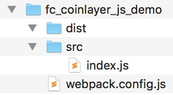

# Steps For Creating Historical Bitcoin Charts Using FusionCharts

## Step 1 Install Webpack and FusionCharts
Create a main directory for the project. Switch to the project directory. Type the following at the console:

```
npm i -D webpack-dev-server html-webpack-plugin path webpack-cli fusioncharts
```

## Step 2: Make src+dist Directories and Create index.js
Entry point for the code is index.js file.

## Step 3: Create webpack.config.js in the main directory
The final directory structure looks as follows:



## Step 4: Start the webpack server And View The App
At the console type:

```
npx webpack serve --mode=development
```

View your app in the browser by typing localhost:8080